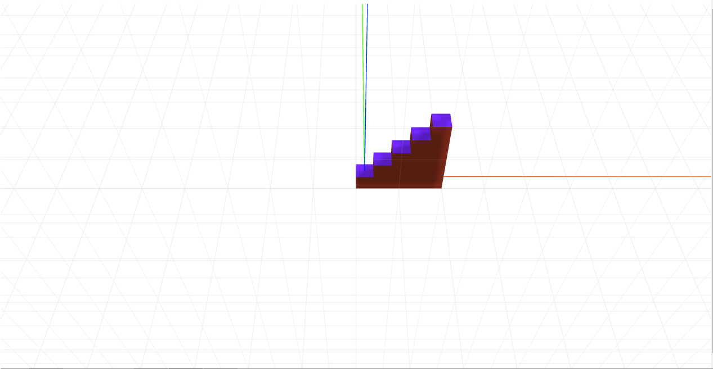

# craft-stairs

# Install
'$ npm install craft-stairs'

# Parameters
```sh
numberOfSteps - determines how many steps the stairs have
```

# Example
```html
<craft>
	<craft name="stairs" module="craft-stairs"/>
	<stairs/>
</craft>
```

